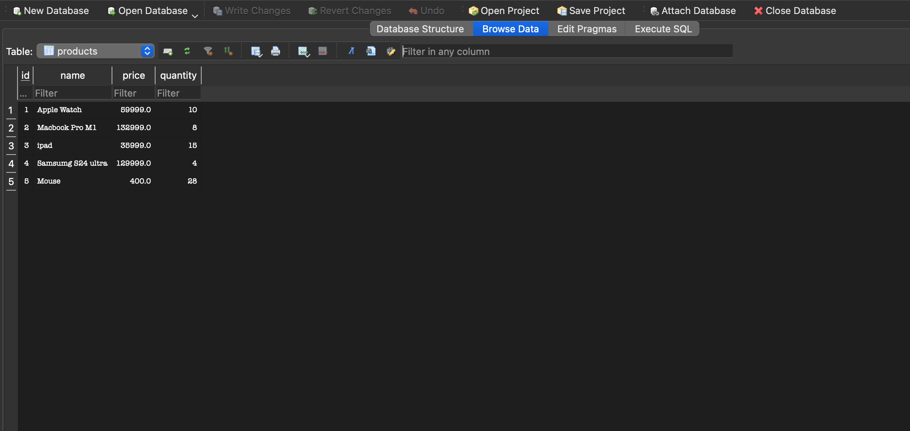

# 📦 Inventory and Stock Management System

A simple and effective command-line Inventory and Stock Management System built with **C++** and powered by **SQLite3** for persistent data storage. This tool helps manage product listings, stock quantities, and inventory operations with ease.

---

## 📸 Sample Output

Here’s a snapshot of the Inventory and Stock Management System in action:

## ✨ Features

- 📋 Add new products to inventory
- ✏️ Update stock for existing products
- ❌ Remove products from inventory
- 🔍 Search products by name
- 📊 Display all inventory data
- 💾 Data persistence using SQLite3
- 🖥️ Command Line Interface

---

## 🛠 Tech Stack

- C++ (g++)
- SQLite3
- Terminal-based UI

---
